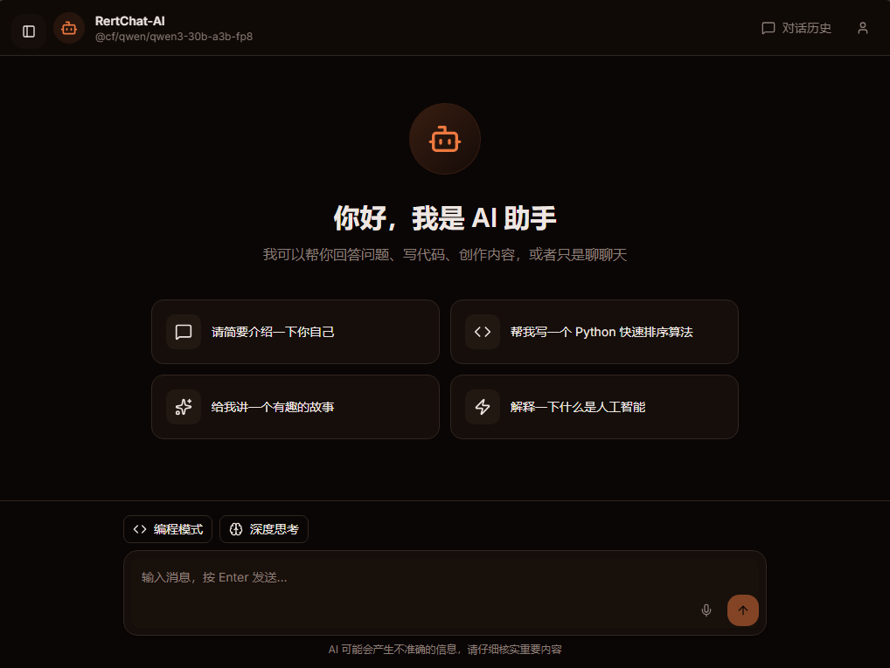
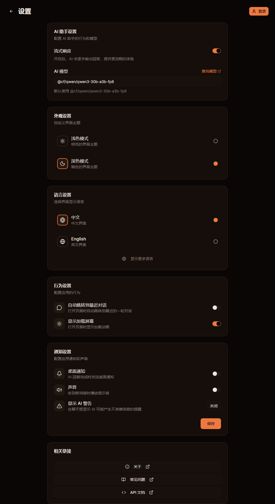
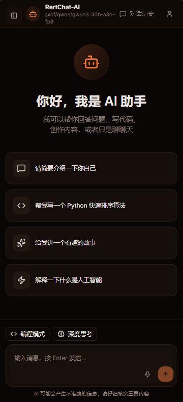
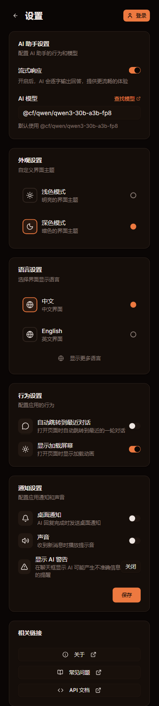

# RertChat

[](https://github.com/RuanMingze/RertChat-Ai)
[](https://github.com/RuanMingze/RertChat-Ai)
[](https://github.com/RuanMingze/RertChat-Ai/issues)
[](https://github.com/RuanMingze/RertChat-Ai)
[](https://developers.cloudflare.com/pages/)
[](https://nextjs.org/)
[](https://react.dev/)

> 📋 **Changelog**: View version history in [CHANGELOG.md](./CHANGELOG.md)

**Project URLs**:
- **Cloudflare Pages Primary**: <https://rertx.dpdns.org>
- **Cloudflare Pages Backup**: <https://rertchat-ai.pages.dev>
- **Vercel Primary**: <https://www.rertx.dpdns.org>
- **Vercel Backup**: <https://rertx.vercel.app>

RertChat is an AI chat assistant based on Cloudflare AI Gateway, supporting multi-turn conversation context, PWA offline access, and more.


## Features

- **Smart Conversation**: AI chat assistant based on Cloudflare AI Gateway
- **Multi-turn Conversation**: Context memory support
- **No Forced Login**: Start chatting immediately without registration
- **Model Switching**: Switch between different AI models anytime
- **Theme Switching**: Light/dark mode support

## Screenshots

### Windows PC


### iPad Pro





### iPhone 14 Pro Max





> Note: Settings page screenshots captured using GoFullPage extension. Mobile screenshots captured using Microsoft Edge DevTools device emulation.

## Supported AI Models

Default supported models:

- `@cf/qwen/qwen3-30b-a3b-fp8` (Qwen)
- `@cf/meta/llama-3-8b-instruct` (Llama 3)
- `@cf/google/gemma-2-27b-it` (Gemma 2)

View more models: <https://developers.cloudflare.com/workers-ai/models/>

## Internationalization (i18n)

RertChat supports multi-language interface. Currently supported languages:

| Language | Code |
|----------|------|
| Chinese (Simplified) | `zh-CN` |
| Chinese (Traditional) | `zh-TW` |
| English | `en-US` |
| Japanese | `ja-JP` |
| Korean | `ko-KR` |
| French | `fr-FR` |
| German | `de-DE` |
| Spanish | `es-ES` |
| Italian | `it-IT` |
| Portuguese (Brazil) | `pt-BR` |
| Russian | `ru-RU` |
| Arabic | `ar-SA` |
| Hindi | `hi-IN` |
| Thai | `th-TH` |
| Vietnamese | `vi-VN` |
| Indonesian | `id-ID` |
| Malay | `ms-MY` |
| Turkish | `tr-TR` |
| Polish | `pl-PL` |
| Dutch | `nl-NL` |

Language packs are located in the `/messages` directory, with one JSON file per language.

### Switching Languages

Users can switch the interface language as follows:

1. **Settings Page**: Click the user avatar or settings icon in the top right corner to enter settings
2. **Language Option**: Find the "Language" option in settings to switch between Chinese and English, or click "Show more languages" to view all languages
3. **Select Language**: Browse or search for your desired language and click the corresponding language card to switch
4. **Instant Effect**: Language changes take effect immediately without page refresh

### Contributing Translations

We use [Crowdin](https://crowdin.com/project/rertchat) for translation management. If you wish to contribute translations or submit new language packs:

1. Visit the [Crowdin Project Page](https://crowdin.com/project/rertchat) and log in
2. Select the language you want to translate
3. Submit your translation suggestions

## PWA & Service Worker

RertChat supports PWA (Progressive Web App) installation and Service Worker offline access.

### Features

| Feature | Description |
|---------|-------------|
| **Install as App** | Install the web app to desktop or mobile home screen |
| **Offline Access** | Access cached pages without network connection |
| **Background Sync** | Auto-sync data when network is restored |
| **Push Notifications** | Desktop notifications for new messages, devices, etc. |
| **Fast Launch** | Full-screen experience from home screen like native app |

### Installation

**Desktop Browser (Chrome/Edge):**
1. After opening the website, an install icon will appear on the right side of the address bar
2. Click the icon to install

**Mobile (iOS/Android):**
1. Open RertChat in Safari/Chrome
2. Tap the "Share" button
3. Select "Add to Home Screen"

### Notes

- Service Worker only works in HTTPS or localhost environments
- Clearing browser cache may remove the installed PWA
- Initial access requires network connection for resource caching

## FAQ

### Getting Started

**Q: How do I start a new conversation?**

A: Click the "New Conversation" button in the left sidebar to start a new conversation. All conversation history is stored in browser local storage.

**Q: How do I export conversation history?**

A: In the chat page, click the menu button in the top right corner and select "Export Conversation". The conversation will be downloaded in Markdown format.

**Q: How do I import conversation history?**

A: Find the "Import Conversation" option in settings and select a previously exported Markdown file.

### Data & Privacy

**Q: Where is conversation data stored?**

A: All conversation data is stored in browser LocalStorage by default and is not uploaded to servers.

**Q: Is my API key secure?**

A: API keys are only stored locally in the browser and are not sent to any third-party servers. It is recommended to regularly rotate keys for security.

**Q: Can I sync conversations across devices?**

A: Currently, conversation data is only stored in the current device's browser. Cross-device sync is not supported.

### Troubleshooting

**Q: What if message sending fails?**

A: Please check your network connection and ensure API key configuration is correct. If the problem persists, try refreshing the page or clearing browser cache.

**Q: What if the page displays incorrectly?**

A: Try clearing browser cache and reloading the page. If the issue persists, please submit an Issue.

**Q：What if I encounter access difficulties or have no browser?**

A：In rare cases, when you encounter access difficulties or have no browser, please scan the following QR code with your phone's camera to access RertChat:


**For more detailed help and the complete FAQ, visit**: <https://rertx.dpdns.org/faq>

## License

RertChat is licensed under the **MIT License**.

### What MIT License Allows You To:

- **Commercial Use**: Use the software for commercial purposes
- **Modify**: Modify the source code to meet your needs
- **Distribute**: Copy and distribute copies of the software
- **Private Use**: Use for personal projects or research

### What MIT License Requires:

- **Preserve Copyright**: Keep the original copyright notice and license text in all copies or substantial portions of the software
- **No Attribution Required**: You are not required to attribute the original author in derivative works

See the [LICENSE](./LICENSE) file in the project root for the full license text.

## Suggestions & Feedback

We value every user's feedback! Whether it's feature suggestions, bug reports, or experience improvements, we welcome your input:

- **Feature Suggestions**: What new features would you like to see?
- **Experience Improvements**: What could be better?
- **Bug Reports**: Found any issues?
- **Community Contributions**: Want to participate in development?

### How to Submit Suggestions

1. **GitHub Issues**: Create a new issue at [GitHub Issues](https://github.com/RuanMingze/RertChat-Ai/issues)
2. **GitHub Discussions**: Join discussions at [GitHub Discussions](https://github.com/RuanMingze/RertChat-Ai/discussions)
3. **Pull Request**: Submit a PR to contribute code!

### Thank You for Your Participation

Every suggestion can make RertChat better! We look forward to building a better lightweight AI chat assistant together.

---

## Performance Metrics

RertChat strives for optimal loading speed and runtime performance:

| Metric | Value |
|--------|-------|
| First Load Time | ~1-2 seconds |
| Interaction Response Latency | < 100ms |
| Production Build Size | < 2MB |
| Compatibility Test Device | NVIDIA GT610 graphics card (runs smoothly) |

## Browser Compatibility

| Browser | Minimum Version | Status | Notes |
|---------|----------------|--------|-------|
| Chrome / Edge | ≥ 90 | ✅ Fully Supported | Recommended for best experience |
| Firefox | ≥ 88 | ✅ Fully Supported | - |
| Safari (macOS) | ≥ 16 | ✅ Fully Supported | - |
| Safari (iOS/iPadOS) | ≥ 16 | ✅ Fully Supported | **Not supported ≤ 15.x (crashes)** |
| Chrome (Android) | ≥ 90 | ✅ Fully Supported | - |

## Mobile Adaptation

RertChat has complete responsive design:

- ✅ **Adaptation Range**: Phones, tablets, desktops
- ✅ **Touch Optimization**: Button sizes, scrolling experience
- ✅ **Orientation Adaptation**: Auto layout adjustment
- ✅ **PWA Installation**: Add to home screen

Recommended Experience:
- iOS/iPadOS ≥ 16
- Android ≥ 11

---

## CI/CD Automation

The project has configured automation workflows:

### Automated Checks

- **Lint Check**: Code style check on every commit
- **TypeScript Compilation**: Ensure type safety
- **Build Validation**: Auto build test on PR

### Local Development Checks

```bash
pnpm lint  # Code style check
pnpm build # Build validation
```

---

# Developer Documentation

## Quick Deployment

### Environment Requirements

- **Node.js**: ≥ 18.x
- **pnpm**: ≥ 8.x

### Step 1: Clone Repository

> **Note**: The GitHub repository name is `RertChat.bly`, which is our naming convention, not a typo.

```bash
git clone https://github.com/RuanMingze/RertChat.bly
cd RertChat.bly
```

### Step 2: Initialize Supabase Database

1. Login to [Supabase Dashboard](https://supabase.com/dashboard)
2. Select your project
3. Go to **SQL Editor** in the left menu
4. Click **New Query**
5. Paste the following SQL and execute:

```sql
-- Table: Store user key associations
-- Column description:
-- user-email: User email, text type, set as primary key (unique identifier, non-null)
-- keys: Key content, variable string, allows null values
CREATE TABLE IF NOT EXISTS keys (
  "user-email" TEXT PRIMARY KEY NOT NULL,
  keys VARCHAR
);

-- Enable Row Level Security (RLS) on keys table
ALTER TABLE keys ENABLE ROW LEVEL SECURITY;

-- Insert policy: Validate current logged-in user email matches record email
CREATE POLICY "Allow users to create keys based on email"
ON keys
FOR INSERT
WITH CHECK (auth.email() = "user-email" OR true);

-- Select policy: Only allow reading own data matching current environment email
CREATE POLICY "Allow users to read their own keys"
ON keys
FOR SELECT
USING ("user-email" = current_setting('app.current_user_email', true));

-- Delete policy: Only allow deleting own data matching current environment email
CREATE POLICY "Allow users to delete their own keys"
ON keys
FOR DELETE
USING ("user-email" = current_setting('app.current_user_email', true));

-- Update policy: Only allow updating own data matching current environment email
CREATE POLICY "Allow users to update their own keys"
ON keys
FOR UPDATE
USING ("user-email" = current_setting('app.current_user_email', true));
```

### Step 3: Configure Environment Variables

Create a `.env.local` file with the following configuration:

| Variable                        | Description                | How to Get                                      |
| ------------------------------ | -------------------------- | ----------------------------------------------- |
| `NEXT_PUBLIC_SITE_URL`         | Public site URL            | Enter your domain for production                 |
| `NEXT_PUBLIC_SUPABASE_URL`     | Supabase project URL       | Supabase Dashboard -> Settings -> API           |
| `NEXT_PUBLIC_SUPABASE_PUB_KEY` | Supabase public key        | Supabase Dashboard -> Settings -> API           |
| `SUPABASE_SECRET_KEY`          | Supabase secret key        | Supabase Dashboard -> Settings -> API           |
| `CLOUDFLARE_USER_ID`           | Cloudflare Account ID      | Cloudflare Dashboard -> Profile -> API Tokens   |
| `CLOUDFLARE_AI_TOKEN`          | Cloudflare AI Token        | Cloudflare Dashboard -> AI -> AI Gateway        |
| `CLOUDFLARE_AI_GATEWAY_ID`     | AI Gateway ID              | Cloudflare Dashboard -> AI -> AI Gateway        |

Refer to the `.env.example` file for complete instructions.

### Step 4: Install Dependencies

```bash
pnpm install
```

### Step 5: Deploy

#### Option 1: Deploy to Cloudflare Pages (Recommended)

```bash
pnpm pages:build
pnpm deploy
```

#### Option 2: Deploy to Vercel

1. Push the project to GitHub
2. Import the project in Vercel
3. Vercel will automatically detect and configure

## Local Development

```bash
pnpm install
pnpm dev
```

Visit <http://localhost:3000>

## Technical Architecture

### Project Architecture

```
┌─────────────────────────────────────────────────────────────────┐
│                         User Browser (Client)                   │
│  ┌─────────────┐  ┌─────────────┐  ┌─────────────┐              │
│  │   Next.js   │  │  IndexedDB  │  │    PWA      │              │
│  │   (Frontend)│  │  (Local Storage)│  (Offline Access)│        │
│  └─────────────┘  └─────────────┘  └─────────────┘              │
└───────────────────────────┬─────────────────────────────────────┘
                            │
                            ▼
┌─────────────────────────────────────────────────────────────────┐
│                     Cloudflare Pages (Deployment)               │
│  ┌─────────────────────────────────────────────────────────┐    │
│  │                    Next.js Application                   │    │
│  │   ┌───────────┐  ┌───────────┐  ┌───────────┐          │    │
│  │   │  Pages    │  │ API Routes │  │ Service   │          │    │
│  │   │  Routes   │  │  (chat)   │  │  Worker   │          │    │
│  │   └───────────┘  └───────────┘  └───────────┘          │    │
│  └─────────────────────────────────────────────────────────┘    │
└───────────────────────────┬─────────────────────────────────────┘
                            │
                            ▼
┌─────────────────────────────────────────────────────────────────┐
│                    Cloudflare Workers (API)                    │
│  ┌─────────────────────────────────────────────────────────┐    │
│  │                     API Services                         │    │
│  │   ┌───────────┐  ┌───────────┐  ┌───────────┐          │    │
│  │   │  /chat    │  │   Proxy   │  │   Other   │          │    │
│  │   │  Chat API │  │  Ruanm OAuth │ │   APIs    │          │    │
│  │   └───────────┘  └───────────┘  └───────────┘          │    │
│  └─────────────────────────────────────────────────────────┘    │
└─────────────────────────────────────────────────────────────────┘
```

> **Note**: This application does not provide OAuth authorization. Login is completed by proxying to the official Ruanm OAuth.

### Built-in AI Chat Architecture

```
┌─────────────────────────────────────────────────────────────────┐
│                         User Browser                            │
│                                                                  │
│    ┌──────────┐      ┌──────────┐      ┌──────────┐            │
│    │  Input   │ ───▶ │  Send    │ ───▶ │  Stream  │            │
│    │  Message │      │  Request │      │  Render  │            │
│    └──────────┘      └──────────┘      └──────────┘            │
└───────────────────────────────┬─────────────────────────────────┘
                                │
                                │ HTTPS Request
                                ▼
┌─────────────────────────────────────────────────────────────────┐
│                    Cloudflare Workers (API)                     │
│                                                                  │
│    ┌──────────────────────────────────────────────────────┐     │
│    │                    Chat Processing Logic              │     │
│    │   ┌────────────┐  ┌────────────┐  ┌────────────┐     │     │
│    │   │  Auth      │  │  Context   │  │  Request   │     │     │
│    │   │  Verify    │──▶│  Manager  │──▶│  Forward   │     │     │
│    │   └────────────┘  └────────────┘  └────────────┘     │     │
│    └──────────────────────────┬───────────────────────────────┘  │
└──────────────────────────────┼────────────────────────────────────┘
                               │
                               │ AI Gateway API
                               ▼
┌─────────────────────────────────────────────────────────────────┐
│                   Cloudflare AI Gateway                          │
│                                                                  │
│    ┌──────────────────────────────────────────────────────┐     │
│    │                    Load Balancing & Routing           │     │
│    │   ┌───────────┐  ┌───────────┐  ┌───────────┐        │     │
│    │   │  Model    │  │  Quota    │  │  Cache    │        │     │
│    │   │  Router   │  │  Manager  │  │  Manager  │        │     │
│    │   └───────────┘  └───────────┘  └───────────┘        │     │
│    └──────────────────────────┬───────────────────────────────┘  │
└──────────────────────────────┼────────────────────────────────────┘
                               │
                               │ AI Inference
                               ▼
┌─────────────────────────────────────────────────────────────────┐
│                      AI Models (Cloud)                          │
│                                                                  │
│    ┌───────────┐  ┌───────────┐  ┌───────────┐  ┌─────────┐    │
│    │ Qwen3     │  │  Llama 3  │  │  Gemma 2  │  │  More...│    │
│    │ 30B       │  │   8B      │  │   27B     │  │         │    │
│    └───────────┘  └───────────┘  └───────────┘  └─────────┘    │
└─────────────────────────────────────────────────────────────────┘
```

## Tech Stack

- **Framework**: Next.js 16 + React 19
- **Language**: TypeScript
- **Styling**: Tailwind CSS + shadcn/ui
- **Storage**: IndexedDB (Client-side local storage)
- **Backend**: Cloudflare Workers (API Services)
- **Deployment**: Vercel / Cloudflare Pages

## Contribution Guide

Welcome every developer to participate in building RertChat!

See [CONTRIBUTING.md](./CONTRIBUTING.md) for detailed contribution guidelines.

### Quick Start

1. Fork this repository
2. Create your feature branch (`git checkout -b feature/AmazingFeature`)
3. Commit your changes (`git commit -m 'feat: Add some AmazingFeature'`)
4. Push to the branch (`git push origin feature/AmazingFeature`)
5. Create a Pull Request

## Deployment & Operations

### Common Deployment Issues

| Symptom | Possible Cause | Solution |
|---------|---------------|----------|
| Blank Page/White Screen | Environment variables not configured | Check all variables in `.env.local` |
| API Request Failed | CLOUDFLARE_AI_TOKEN expired | Regenerate Token in Cloudflare |
| Login Failed | OAuth Callback URL mismatch | Verify `NEXT_PUBLIC_SITE_URL` matches OAuth config |
| Build Failed | Incompatible dependency versions | Delete `node_modules` and `pnpm-lock.yaml`, reinstall with `pnpm install` |
| Static Resource Load Failed | Incorrect path configuration | Check `basePath` and `assetPrefix` in `next.config.js` |

### Viewing Logs

#### Local Development Logs

```bash
pnpm dev
```

Terminal will show:
- Next.js build information
- API request logs
- Error stack traces

#### Cloudflare Pages Logs

1. Login to [Cloudflare Dashboard](https://dash.cloudflare.com/)
2. Go to your Pages project
3. Click **View Details**
4. Switch to **Deployments** tab
5. Click specific deployment to view build logs

#### Cloudflare Workers Logs

1. Login to [Cloudflare Dashboard](https://dash.cloudflare.com/)
2. Go to **Workers & Pages**
3. Select your Worker
4. Click **Logs** tab
5. View:
   - Real-time request logs
   - Historical request records
   - Error logs
   - Console.log() output

#### Enable Real-time Logs

```bash
# Run in local terminal
pnpm pages:dev
```

This starts the local Pages development server and shows real-time requests and logs.

### Environment Variables Checklist

Confirm the following variables are correctly configured before deployment:

- [ ] `NEXT_PUBLIC_SITE_URL` - Production domain (must match OAuth callback)
- [ ] `CLOUDFLARE_AI_TOKEN` - AI Token not expired
- [ ] `CLOUDFLARE_AI_GATEWAY_ID` - AI Gateway created
- [ ] `CLOUDFLARE_USER_ID` - Cloudflare Account ID correct

## API Documentation

### Chat API

**POST /api/chat**

Send message and get AI response.

Request Body:
```json
{
  "message": "Hello",
  "history": [],
  "model": "@cf/qwen/qwen3-30b-a3b-fp8"
}
```

Response:
Returns streaming response (Server-Sent Events)

### Complete Documentation

Detailed API documentation: <https://rertx.dpdns.org/docs/>

## Security Measures

RertChat implements multiple security measures to protect user data:

### 1. Row Level Security (RLS)

Database access uses Supabase Row Level Security:

```sql
-- Only allow users to access their own data
CREATE POLICY "Allow users to read their own keys"
ON keys
FOR SELECT
USING ("user-email" = current_setting('app.current_user_email', true));
```

### 2. Data Isolation

- User data stored in IndexedDB (browser local)
- Sensitive information (like API Key) encrypted
- Server does not store user conversation history

### 3. Input Validation

- All user inputs sanitized
- XSS attack prevention
- Input length and format restrictions

### 4. OAuth Security

- Uses official Ruanm OAuth authorization
- Strict Callback URL validation
- Short-lived Token mechanism

### 5. Transport Security

- Enforced HTTPS
- Secure Headers for API requests
- CSP (Content Security Policy) support

## Acknowledgments

- [shadcn/ui](https://ui.shadcn.com/) - UI component library
- [Cloudflare Workers](https://workers.cloudflare.com/) - Serverless runtime
- [Cloudflare AI](https://www.cloudflare.com/) - AI model support

---

## Disclaimer

The Chinese national flag pattern is sourced from the official website of the State Council of the People's Republic of China (www.gov.cn). It is used solely to identify language regions, without any modification, distortion, or commercial use. Its use is completely legal.