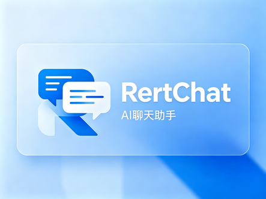
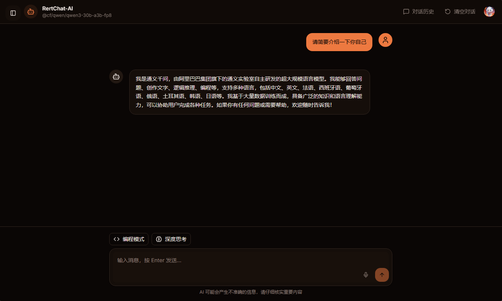
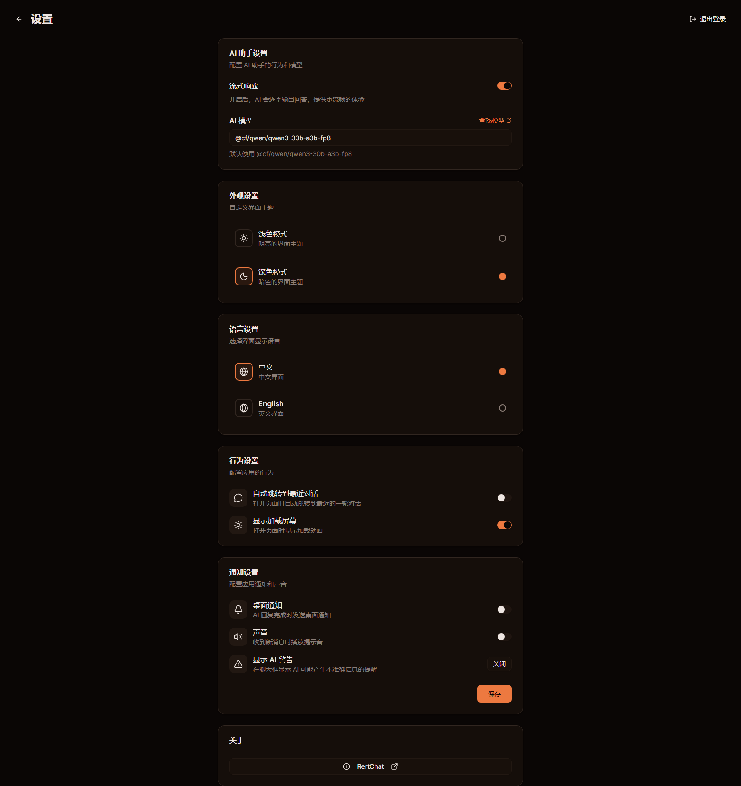

# RertChat

[](https://github.com/RuanMingze/RertChat-Ai)
[](https://github.com/RuanMingze/RertChat-Ai)
[](https://github.com/RuanMingze/RertChat-Ai/issues)
[](https://github.com/RuanMingze/RertChat-Ai)
[](https://developers.cloudflare.com/pages/)
[](https://nextjs.org/)
[](https://react.dev/)

> 📋 **更新日志**：查看版本更新历史，请阅读 [CHANGELOG.md](./CHANGELOG.md)

RertChat 是一个基于 Cloudflare AI Gateway 的智能对话助手，支持流式输出、多轮对话上下文、PWA 离线访问等功能。



## 功能特性

- **智能对话**：基于 Cloudflare AI Gateway 的智能对话功能
- **流式输出**：AI 回答逐字显示
- **多轮对话**：支持上下文记忆
- **无强制登录**：可立即开始对话，无需注册
- **模型切换**：随时切换不同的 AI 模型
- **主题切换**：支持浅色/深色模式

## 支持的 AI 模型

默认支持以下模型：

- `@cf/qwen/qwen3-30b-a3b-fp8` (通义千问)
- `@cf/meta/llama-3-8b-instruct` (Llama 3)
- `@cf/google/gemma-2-27b-it` (Gemma 2)

查看更多模型：<https://developers.cloudflare.com/workers-ai/models/>

## 界面预览





## PWA 与 Service Worker

RertChat 支持 PWA（渐进式网页应用）安装和 Service Worker 离线访问。

### 功能特性

| 功能 | 说明 |
|------|------|
| **安装为应用** | 可将网页安装到桌面或手机主屏幕 |
| **离线访问** | 无网络时仍可访问已缓存的页面 |
| **后台同步** | 网络恢复后自动同步数据 |
| **推送通知** | 支持桌面通知提醒（新消息、设备等） |
| **快速启动** | 从主屏幕打开即全屏运行，体验如原生应用 |

### 安装方式

**桌面浏览器 (Chrome/Edge)：**
1. 打开网址后，地址栏右侧会出现安装图标
2. 点击图标即可安装

**移动端 (iOS/Android)：**
1. 在 Safari/Chrome 中打开 RertChat
2. 点击"分享"按钮
3. 选择"添加到主屏幕"

### 注意事项

- Service Worker 仅在 HTTPS 或 localhost 环境下可用
- 清除浏览器缓存可能会移除已安装的 PWA
- 首次访问需要联网以完成资源缓存

## 许可证

MIT License

## 建议与反馈

我们非常重视每一位用户的声音！无论是功能建议、bug 反馈还是体验优化，都欢迎大家积极提出：

- **功能建议**：希望添加什么新功能？
- **体验优化**：哪些地方可以做得更好？
- **Bug 反馈**：发现了任何问题？
- **社区贡献**：想参与项目开发？

### 如何提出建议

1. **GitHub Issues**：前往 [GitHub Issues](https://github.com/RuanMingze/RertChat-Ai/issues) 创建新 issue
2. **GitHub Discussions**：参与 [GitHub Discussions](https://github.com/RuanMingze/RertChat-Ai/discussions) 讨论
3. **Pull Request**：欢迎提交 PR 贡献代码！

### 感谢你的参与

每一个建议都可能让 RertChat 变得更好！我们期待与大家一起打造更出色的轻量级 AI 对话助手。

---

## 性能指标

RertChat 追求极致的加载速度和运行性能：

| 指标 | 数值 |
|------|------|
| 首次加载时间 | ~1-2 秒 |
| 交互响应延迟 | &lt; 100ms |
| 生产构建大小 | &lt; 2MB |
| 兼容性测试设备 | NVIDIA GT610 显卡设备（流畅运行） |

## 浏览器兼容性

| 浏览器 | 最低版本 | 状态 | 备注 |
|--------|---------|------|------|
| Chrome / Edge | ≥ 90 | ✅ 完全支持 | 推荐体验最佳 |
| Firefox | ≥ 88 | ✅ 完全支持 | - |
| Safari (macOS) | ≥ 16 | ✅ 完全支持 | - |
| Safari (iOS/iPadOS) | ≥ 16 | ✅ 完全支持 | **不支持 ≤ 15.x（会卡死）** |
| Chrome (Android) | ≥ 90 | ✅ 完全支持 | - |

## 移动端适配

RertChat 已完善响应式设计：

- ✅ **适配范围**：手机、平板、桌面
- ✅ **触摸优化**：按钮尺寸、滚动体验
- ✅ **横竖屏适配**：自动布局调整
- ✅ **PWA 安装**：添加到主屏幕

推荐体验：
- iOS/iPadOS ≥ 16
- Android ≥ 11

---

## CI/CD 自动化流程

项目已配置自动化流程：

### 自动化检查

- **Lint 检查**：每次提交自动运行代码规范检查
- **TypeScript 编译**：确保类型安全
- **构建验证**：PR 时自动构建测试

### 本地运行检查

```bash
pnpm lint  # 代码规范检查
pnpm build # 构建验证
```

---

# 开发者文档

## 快速部署

### 环境要求

- **Node.js**: ≥ 18.x
- **pnpm**: ≥ 8.x

### 第一步：克隆开源版本

> **注意**：GitHub 仓库名称为 `RertChat.bly`，这是项目我们的命名习惯，并非拼写错误。

```bash
git clone https://github.com/RuanMingze/RertChat.bly
cd RertChat.bly
```

### 第二步：初始化 Supabase 数据库

1. 登录 [Supabase Dashboard](https://supabase.com/dashboard)
2. 选择你的项目
3. 进入左侧菜单 **SQL Editor**
4. 点击 **New Query**
5. 粘贴以下 SQL 并执行：

```sql
-- 数据表：存储用户密钥关联
-- 字段说明：
-- user-email：用户邮箱，文本类型，设为主键（唯一标识、非空）
-- keys：密钥内容，可变字符串，允许为空值
CREATE TABLE IF NOT EXISTS keys (
  "user-email" TEXT PRIMARY KEY NOT NULL,
  keys VARCHAR
);

-- 为 keys 表开启行级安全策略(RLS)
ALTER TABLE keys ENABLE ROW LEVEL SECURITY;

-- 插入策略：校验当前登录用户邮箱与记录邮箱一致
CREATE POLICY "允许用户基于 email 创建 keys"
ON keys
FOR INSERT
WITH CHECK (auth.email() = "user-email" OR true);

-- 查询策略：仅允许读取与当前环境邮箱匹配的自身数据
CREATE POLICY "允许用户读取自己的 keys"
ON keys
FOR SELECT
USING ("user-email" = current_setting('app.current_user_email', true));

-- 删除策略：仅允许删除与当前环境邮箱匹配的自身数据
CREATE POLICY "允许用户删除自己的 keys"
ON keys
FOR DELETE
USING ("user-email" = current_setting('app.current_user_email', true));

-- 更新策略：仅允许更新与当前环境邮箱匹配的自身数据
CREATE POLICY "允许用户更新自己的 keys"
ON keys
FOR UPDATE
USING ("user-email" = current_setting('app.current_user_email', true));
```

### 第三步：配置环境变量

复制 `.env.example` 文件为 `.env.local`：

```bash
# Windows
copy .env.example .env.local

# Linux/macOS
cp .env.example .env.local
```

新建 `.env.local` 文件，填写以下配置：

| 配置项                            | 说明                    | 获取方式                                          |
| ------------------------------ | --------------------- | --------------------------------------------- |
| `NEXT_PUBLIC_SITE_URL`         | 站点公开访问地址              | 生产环境填写你的域名                                    |
| `NEXT_PUBLIC_SUPABASE_URL`     | Supabase 项目地址         | Supabase Dashboard -> Settings -> API         |
| `NEXT_PUBLIC_SUPABASE_PUB_KEY` | Supabase 公开密钥         | Supabase Dashboard -> Settings -> API         |
| `SUPABASE_SECRET_KEY`          | Supabase 服务密钥         | Supabase Dashboard -> Settings -> API         |
| `CLOUDFLARE_USER_ID`           | Cloudflare Account ID | Cloudflare Dashboard -> Profile -> API Tokens |
| `CLOUDFLARE_AI_TOKEN`          | Cloudflare AI Token   | Cloudflare Dashboard -> AI -> AI Gateway      |
| `CLOUDFLARE_AI_GATEWAY_ID`     | AI Gateway ID         | Cloudflare Dashboard -> AI -> AI Gateway      |

也可以参考 `.env.example` 文件中的完整说明。

### 第四步：安装依赖

```bash
pnpm install
```

### 第五步：部署

#### 方式一：部署到 Cloudflare Pages（推荐）

```bash
pnpm pages:build
pnpm deploy
```

#### 方式二：部署到 Vercel

1. 将项目推送到 GitHub
2. 在 Vercel 导入项目
3. Vercel 会自动检测并配置

## 本地开发

```bash
pnpm install
pnpm dev
```

访问 <http://localhost:3000>

## 技术架构

### 项目架构

```
┌─────────────────────────────────────────────────────────────────┐
│                         用户浏览器 (Client)                       │
│  ┌─────────────┐  ┌─────────────┐  ┌─────────────┐              │
│  │   Next.js   │  │  IndexedDB  │  │    PWA      │              │
│  │   (前端)    │  │  (本地存储)  │  │  (离线访问)  │              │
│  └─────────────┘  └─────────────┘  └─────────────┘              │
└───────────────────────────┬─────────────────────────────────────┘
                            │
                            ▼
┌─────────────────────────────────────────────────────────────────┐
│                     Cloudflare Pages (部署)                      │
│  ┌─────────────────────────────────────────────────────────┐     │
│  │                    Next.js 应用                          │     │
│  │   ┌───────────┐  ┌───────────┐  ┌───────────┐          │     │
│  │   │   页面    │  │  API 路由  │  │ Service   │          │     │
│  │   │  路由    │  │  (chat)   │  │  Worker   │          │     │
│  │   └───────────┘  └───────────┘  └───────────┘          │     │
│  └─────────────────────────────────────────────────────────┘     │
└───────────────────────────┬─────────────────────────────────────┘
                            │
                            ▼
┌─────────────────────────────────────────────────────────────────┐
│                    Cloudflare Workers (API)                       │
│  ┌─────────────────────────────────────────────────────────┐     │
│  │                     API 服务                            │     │
│  │   ┌───────────┐  ┌───────────┐  ┌───────────┐          │     │
│  │   │  /chat    │  │   转发    │  │   其他    │          │     │
│  │   │  对话接口  │  │  Ruanm OAuth │ │   接口    │          │     │
│  │   └───────────┘  └───────────┘  └───────────┘          │     │
│  └─────────────────────────────────────────────────────────┘     │
└─────────────────────────────────────────────────────────────────┘
```

> **注意**：本应用不提供 OAuth 授权接口，登录功能通过转发到官方 Ruanm OAuth 完成。

### 内置 AI 聊天架构

```
┌─────────────────────────────────────────────────────────────────┐
│                         用户浏览器                                │
│                                                                  │
│    ┌──────────┐      ┌──────────┐      ┌──────────┐            │
│    │  输入框   │ ───▶ │  发送    │ ───▶ │  流式    │            │
│    │  用户消息  │      │  请求    │      │  渲染    │            │
│    └──────────┘      └──────────┘      └──────────┘            │
└───────────────────────────────┬─────────────────────────────────┘
                                │
                                │ HTTPS Request
                                ▼
┌─────────────────────────────────────────────────────────────────┐
│                    Cloudflare Workers (API)                      │
│                                                                  │
│    ┌──────────────────────────────────────────────────────┐     │
│    │                    聊天处理逻辑                         │     │
│    │   ┌────────────┐  ┌────────────┐  ┌────────────┐     │     │
│    │   │  认证     │  │  上下文    │  │  请求     │     │     │
│    │   │  验证     │──▶│  管理     │──▶│  转发     │     │     │
│    │   └────────────┘  └────────────┘  └────────────┘     │     │
│    └──────────────────────────┬───────────────────────────────┘     │
└──────────────────────────────┼────────────────────────────────────┘
                               │
                               │ AI Gateway API
                               ▼
┌─────────────────────────────────────────────────────────────────┐
│                   Cloudflare AI Gateway                          │
│                                                                  │
│    ┌──────────────────────────────────────────────────────┐     │
│    │                    负载均衡 & 路由                      │     │
│    │   ┌───────────┐  ┌───────────┐  ┌───────────┐        │     │
│    │   │  模型    │  │  配额    │  │  缓存    │        │     │
│    │   │  路由    │  │  管理    │  │  管理    │        │     │
│    │   └───────────┘  └───────────┘  └───────────┘        │     │
│    └──────────────────────────┬───────────────────────────────┘     │
└──────────────────────────────┼────────────────────────────────────┘
                               │
                               │ AI Inference
                               ▼
┌─────────────────────────────────────────────────────────────────┐
│                      AI Models (云端模型)                        │
│                                                                  │
│    ┌───────────┐  ┌───────────┐  ┌───────────┐  ┌─────────┐    │
│    │ Qwen3     │  │  Llama 3  │  │  Gemma 2  │  │ 更多...  │    │
│    │ 30B       │  │   8B      │  │   27B     │  │         │    │
│    └───────────┘  └───────────┘  └───────────┘  └─────────┘    │
└─────────────────────────────────────────────────────────────────┘
```

## 技术栈

- **框架**：Next.js 16 + React 19
- **语言**：TypeScript
- **样式**：Tailwind CSS + shadcn/ui
- **存储**：IndexedDB（客户端本地存储）
- **后端**：Cloudflare Workers（API服务）
- **部署**：Vercel / Cloudflare Pages

## 贡献指南

欢迎每一位开发者参与 RertChat 的建设！

详细贡献规范请查看 [CONTRIBUTING.md](./CONTRIBUTING.md)

### 快速开始

1. Fork 本仓库
2. 创建你的特性分支 (`git checkout -b feature/AmazingFeature`)
3. 提交你的更改 (`git commit -m 'feat: Add some AmazingFeature'`)
4. 推送到分支 (`git push origin feature/AmazingFeature`)
5. 创建一个 Pull Request

## 部署与运维

### 常见部署问题排查

| 问题现象 | 可能原因 | 解决方案 |
|---------|---------|---------|
| 页面空白/白屏 | 环境变量未配置 | 检查 `.env.local` 中的所有配置项 |
| API 请求失败 | CLOUDFLARE_AI_TOKEN 过期 | 前往 Cloudflare 重新生成 Token |
| 登录失败 | OAuth Callback URL 不匹配 | 检查 `NEXT_PUBLIC_SITE_URL` 是否与 OAuth 配置一致 |
| 构建失败 | 依赖版本不兼容 | 删除 `node_modules` 和 `pnpm-lock.yaml`，重新 `pnpm install` |
| 静态资源加载失败 | 路径配置错误 | 检查 `next.config.js` 中的 basePath 和 assetPrefix |

### 查看日志

#### 本地开发日志

```bash
pnpm dev
```

终端会显示：
- Next.js 构建信息
- API 请求日志
- 错误堆栈信息

#### Cloudflare Pages 日志

1. 登录 [Cloudflare Dashboard](https://dash.cloudflare.com/)
2. 进入你的 Pages 项目
3. 点击 **查看详情**
4. 切换到 **部署** 标签
5. 点击具体部署版本查看构建日志

#### Cloudflare Workers 日志

1. 登录 [Cloudflare Dashboard](https://dash.cloudflare.com/)
2. 进入 **Workers & Pages**
3. 选择你的 Worker
4. 点击 **日志** 标签
5. 可查看：
   - 实时请求日志
   - 历史请求记录
   - 错误日志
   - Console.log() 输出

#### 启用实时日志

```bash
# 在本地终端运行
pnpm pages:dev
```

这将启动本地 Pages 开发服务器，并显示实时请求和日志。

### 环境变量检查清单

部署前确认以下所有变量已正确配置：

- [ ] `NEXT_PUBLIC_SITE_URL` - 生产环境域名（必须与 OAuth callback 一致）
- [ ] `CLOUDFLARE_AI_TOKEN` - AI Token 未过期
- [ ] `CLOUDFLARE_AI_GATEWAY_ID` - AI Gateway 已创建
- [ ] `CLOUDFLARE_USER_ID` - Cloudflare Account ID 正确

## API 文档

### 对话接口

**POST /api/chat**

发送消息并获取 AI 响应。

请求体：
```json
{
  "message": "你好",
  "history": [],
  "model": "@cf/qwen/qwen3-30b-a3b-fp8",
  "stream": true
}
```

响应：
- **stream=true**：返回流式响应（Server-Sent Events）
- **stream=false**：返回完整 JSON 响应

目前暂不支持非流式响应。

### 完整文档

详细的 API 文档请访问：<https://rertx.dpdns.org/docs/>

## 安全措施

RertChat 采取了多项安全措施来保护用户数据：

### 1. 行级安全策略 (RLS)

数据库访问使用 Supabase 行级安全策略：

```sql
-- 仅允许用户访问自己的数据
CREATE POLICY "允许用户读取自己的 keys"
ON keys
FOR SELECT
USING ("user-email" = current_setting('app.current_user_email', true));
```

### 2. 数据隔离

- 用户数据存储在 IndexedDB（浏览器本地）
- 敏感信息（如 API Key）加密存储
- 服务器端不存储用户对话历史

### 3. 输入验证

- 所有用户输入进行转义处理
- 防止 XSS 攻击
- 限制输入长度和格式

### 4. OAuth 安全

- 使用官方 Ruanm OAuth 授权
- Callback URL 严格验证
- 短期 Token 机制

### 5. 传输安全

- 强制 HTTPS 传输
- API 请求使用安全 Headers
- 支持 CSP（内容安全策略）

## 致谢

- [shadcn/ui](https://ui.shadcn.com/) - UI 组件库
- [Cloudflare Workers](https://workers.cloudflare.com/) - Serverless 运行
- [Cloudflare AI](https://www.cloudflare.com/) - AI 模型支持